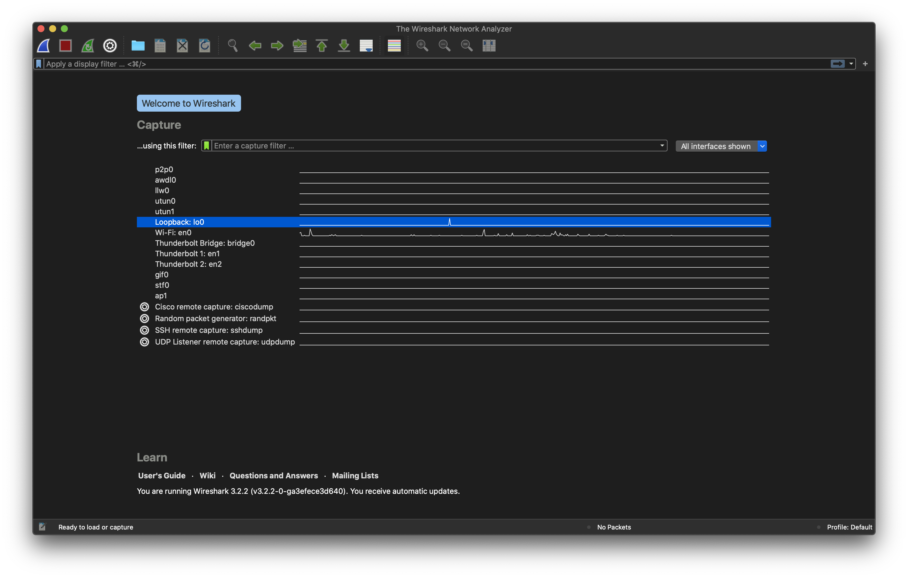
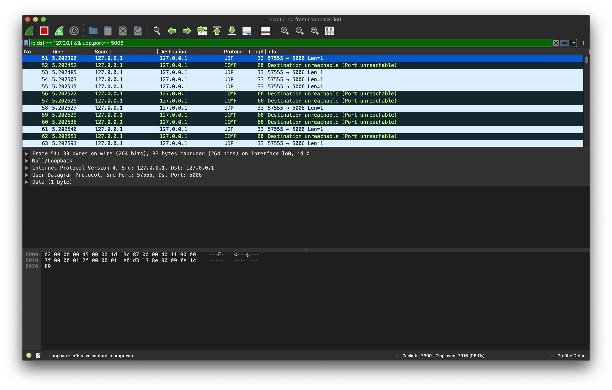
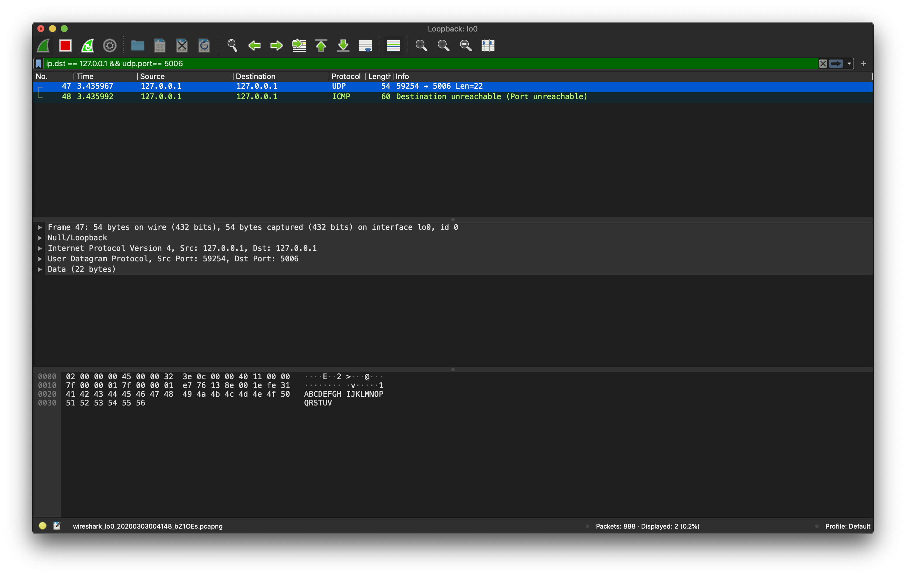

# Pemrograman Jaringan

Ananta Dwi Prasetya Purna Yuda  
05111740000029

## Tugas 2
### Soal
Menggunakan wireshark, capture :

1. Hasil Keluaran dari program udpfileclient.py ke alamat 127.0.0.1 ke port 5006
2. Hasil Keluaran dari program udp_simple.py ke alamat 127.0.0.1 di port 5006

### Jawab
#### No 1
1. Ganti ip serta port pada file udpfileclient.py ke alamat 127.0.0.1 dan port 5006
2. Buka wireshark, pilih interface `Loopback: lo0` 
    
3. Isikan filter `ip.dst == 127.0.0.1 && udp.dstport == 5006`
4. Jalankan file python
    ```bash
    python3 udpfileclient.py
    ```
5. Lihat hasil capture wireshark
    

#### No 2
1. Ganti ip serta port pada file udp_simple.py ke alamat 127.0.0.1 dan port 5006
2. Buka wireshark, pilih interface `Loopback: lo0` 
    
3. Isikan filter `ip.dst == 127.0.0.1 && udp.dstport == 5006`
4. Jalankan file python
    ```bash
    python3 udp_simple.py
    ```
5. Lihat hasil capture wireshark
    
