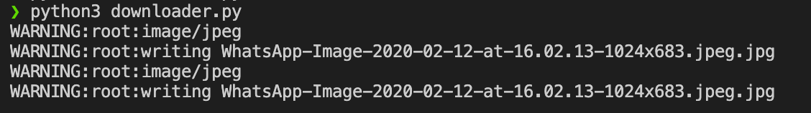

# Pemrograman Jaringan

Ananta Dwi Prasetya Purna Yuda  
05111740000029

## Tugas 3
### Usage
1. Tambahkan url pada array `url_gambars` dalam file `downloader.py`
2. Jalankan program
    ```bash
    python3 downloader.py
    ```

### Result


