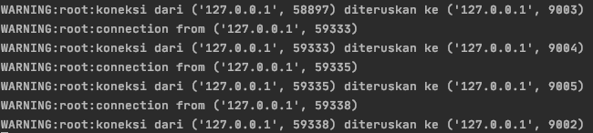

# Pemrograman Jaringan

Ananta Dwi Prasetya Purna Yuda  
05111740000029

## Tugas 10

### Log Load Balancer



### Test Benchmark

#### a. async_server  

Command

``` shell script
# run backend server
python3 async_server.py 9002
python3 async_server.py 9003
python3 async_server.py 9004
python3 async_server.py 9005

# run load balancer
python3 lb.py

ab -n 1000 -c <concurrency> http://127.0.0.1:44444/testing.txt
```

Result  

No test|Concurrency level|Time taken for test (seconds)|Complete request|Failed request|Total transferred (bytes)|Request per second|Time per request (ms)|Transfer rate (KBps)
:---:|:---:|:---:|:---:|:---:|:---:|:---:|:---:|:---:
1|1|0.848|1000|0|159000|1179.16|0.848|167.35
2|5|0.694|1000|0|159000|1440.86|0.694|223.73
3|10|0.402|1000|0|159000|2485.24|0.402|385.89


#### b. thread_server

Command

``` shell script
# run backend server
python3 thread_server.py 9002
python3 thread_server.py 9003
python3 thread_server.py 9004
python3 thread_server.py 9005

# run load balancer
python3 lb.py

ab -n 1000 -c <concurrency> http://127.0.0.1:44444/testing.txt
```

Result  

No test|Concurrency level|Time taken for test (seconds)|Complete request|Failed request|Total transferred (bytes)|Request per second|Time per request (ms)|Transfer rate (KBps)
:---:|:---:|:---:|:---:|:---:|:---:|:---:|:---:|:---:
1|1|1.045|1000|278|114798|956.53|1.045|107.23
2|5|0.558|1000|0|159000|1791.42|0.558|278.16
3|10|0.510|1000|2|158682|1959.28|0.510|303.62

Test ke-3 kadang mengalami `Connection reset by peer`