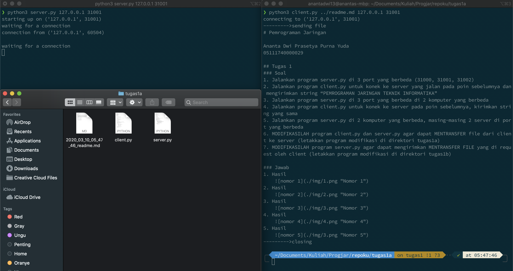

# Pemrograman Jaringan

Ananta Dwi Prasetya Purna Yuda  
05111740000029

## Tugas 1
### Soal
1. Jalankan program server.py di 3 port yang berbeda (31000, 31001, 31002)
2. Jalankan program client.py untuk konek ke server yang jalan pada poin sebelumnya dan mengirimkan string “PEMROGRAMAN JARINGAN TEKNIK INFORMATIKA”
3. Jalankan program server.py di 3 port yang berbeda di 2 komputer yang berbeda
4. Jalankan program client.py untuk konek ke server pada poin sebelumnya, kirimkan string yang sama
5. Jalankan program server.py di 2 komputer yang berbeda, masing-masing 2 server di port yang berbeda
6. MODIFIKASILAH program client.py dan server.py agar dapat MENTRANSFER file dari client ke server (letakkan program modifikasi di direktori tugas1a)
7. MODIFIKASILAH program server.py agar dapat mengirimkan MENTRANSFER FILE yang di request oleh client (letakkan program modifikasi di direktori tugas1b)

### Jawab
1. Hasil
    
2. Hasil
    
3. Hasil
    
4. Hasil
    
5. Hasil
    
6. Hasil
    
7. Hasil
    